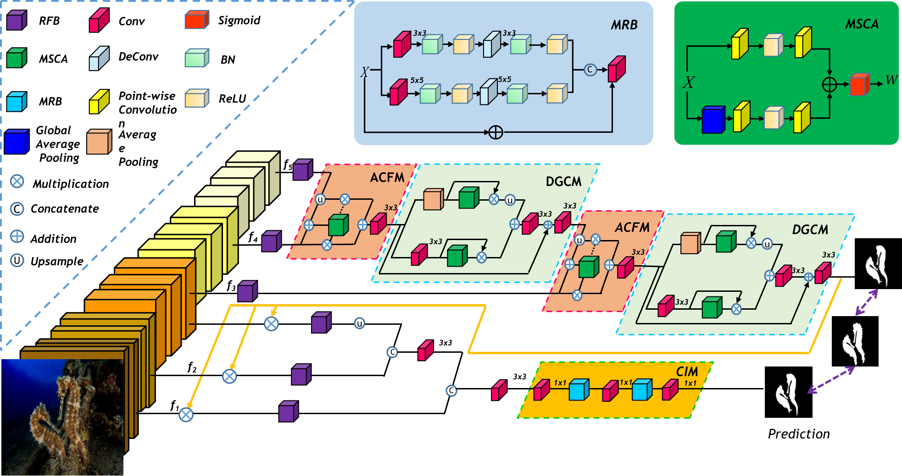
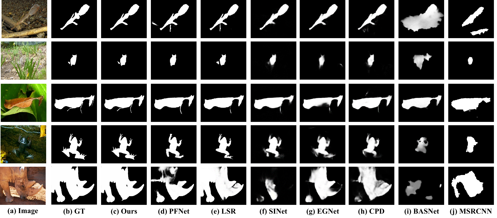

# C2F-Net: Camouflaged Object Detection via Context-aware Cross-level Fusion
> **Authors:** 
> [Geng chen](https://www.researchgate.net/profile/Geng_Chen13),
>Si-Jie Liu,
>Yu-Jia Sun
> [Ge-Peng Ji](https://scholar.google.com/citations?user=oaxKYKUAAAAJ&hl=en),
>Ya-Feng Wu, and
> [Tao Zhou](https://taozh2017.github.io/),

## 1. Preface

- This repository provides code for "_**C2F-Net: Camouflaged Object Detection via Context-aware Cross-level Fusion**_" IJCAI-2021. 
([paper]())

- If you have any questions about our paper, feel free to contact me. And if you are using C2F-Net
or evaluation toolbox for your research, please cite this paper ([BibTeX](#4-citation)).

### 1.1. Table of Contents

- [C2F-Net: Camouflaged Object Detection via Context-aware Cross-level Fusion](#C2F-Net--amouflaged Object Detection via Context-aware Cross-level Fusion--IJCAI-2021-)
  * [1. Preface](#1-preface)
    + [1.1. Table of Contents](#11-table-of-contents)
  * [2. Overview](#2-overview)
    + [2.1. Introduction](#21-introduction)
    + [2.2. Framework Overview](#22-framework-overview)
    + [2.3. Qualitative Results](#23-qualitative-results)
  * [3. Proposed Baseline](#3-proposed-baseline)
    + [3.1 Training/Testing](#31-training-testing)
    + [3.2 Evaluating your trained model:](#32-evaluating-your-trained-model-)
    + [3.3 Pre-computed maps:](#33-pre-computed-maps)
  * [4. Citation](#4-citation)
  * [5. License](#5-license)

<small><i><a href='http://ecotrust-canada.github.io/markdown-toc/'>Table of contents generated with markdown-toc</a></i></small>

## 2. Overview

### 2.1. Introduction

Camouflaged object detection (COD) is a challenging task due to the low boundary contrast between the object and its surroundings. In addition, the appearance of camouflaged objects varies significantly, e.g., object size and shape, aggravating the difficulties of accurate COD. In this paper, we propose a novel Context-aware Cross-level Fusion Network (C2FNet) to address the challenging COD task. Specifically,  an attention-induced cross-level fusion module (ACFM) is proposed to fuse high-level features, and a dual-branch global context module (DGCM) is proposed to fully exploit multi-scale context information from the fused features. Two modules are organized in a cascaded manner. The last DGCM provides an initial prediction. We then refine the low-level features  with the initial prediction and predict the final COD result with our camouflage inference module (CIM.)
### 2.2. Framework Overview

      
    <em> 
    Figure 1: The overall architecture of the proposed model, which consists of two key components, i.e., attention-induced cross-level fusion module, dual-branch global context module and camouflage inference module in. See § 3 in the paper for details.
    </em>

### 2.3. Qualitative Results

      
    <em> 
    Figure 2: Qualitative Results.
    </em>

## 3. Proposed Baseline

### 3.1. Training/Testing

The training and testing experiments are conducted using [PyTorch](https://github.com/pytorch/pytorch) with a single NVIDIA Tesla V100 GPU of 32 GB Memory.

> Note that our model also supports low memory GPU, which means you can lower the batch size

1. Configuring your environment (Prerequisites):
   
    Note that PraNet is only tested on Ubuntu OS with the following environments. 
    It may work on other operating systems as well but we do not guarantee that it will.
    
    + Creating a virtual environment in terminal: `conda create -n C2FNet python=3.6`.
    
    + Installing necessary packages: `pip install -r requirements.txt`.

1. Downloading necessary data:

    + downloading testing dataset and move it into `./data/TestDataset/`, 
    which can be found in this [download link (Google Drive)](https://drive.google.com/file/d/1o8OfBvYE6K-EpDyvzsmMPndnUMwb540R/view?usp=sharing).
    
    + downloading training dataset and move it into `./data/TrainDataset/`, 
    which can be found in this [download link (Google Drive)](https://drive.google.com/file/d/1lODorfB33jbd-im-qrtUgWnZXxB94F55/view?usp=sharing).
    
    + downloading pretrained weights and move it into `./checkpoints/C2FNet/C2FNet-49.pth`, 
    which can be found in this [download link (BaiduNetdisk)](https://pan.baidu.com/s/1WLRdub4Rz7xSxd-vuMqEaQ)  keys: c0cc.
    
    + downloading Res2Net weights [download link (Google Drive)](https://drive.google.com/file/d/1_1N-cx1UpRQo7Ybsjno1PAg4KE1T9e5J/view?usp=sharing).
   
1. Training Configuration:

    + Assigning your costumed path, like `--train_save` and `--train_path` in `MyTrain.py`.
    + I modify the total epochs and the learning rate decay method (lib/utils.py has been updated), so there are differences from the training setup reported in the paper. Under the new settings, the training performance is more stable.
    

1. Testing Configuration:
    + After you download all the pre-trained model and testing dataset, just run `MyTest.py` to generate the final prediction map: 
    replace your trained model directory (`--pth_path`).

    + Just enjoy it!

### 3.2 Evaluating your trained model:

One-key evaluation is written in MATLAB code (revised from [link](https://github.com/DengPingFan/CODToolbox)), 
please follow this the instructions in `./eval/main.m` and just run it to generate the evaluation results in.

If you want to speed up the evaluation on GPU, you just need to use the efficient tool [link](https://github.com/lartpang/PySODMetrics) by `pip install pysodmetrics`.

Assigning your costumed path, like `method`, `mask_root` and `pred_root` in `eval.py`.

Just run `eval.py` to evaluate the trained model.

### 3.3 Pre-computed maps: 
> pre-computed map can be found in [download link((BaiduNetdisk)](https://pan.baidu.com/s/18NV-lPs6vbk80wH88Ugzyg)  keys: 6k6d

## 4. Citation

Please cite our paper if you find the work useful: 

Please cite our paper if you find the work useful: 

	@inproceedings{sun2021c2fnet,
	title={Context-aware Cross-level Fusion Network for Camouflaged Object Detection},
	author={Sun, Yujia and Chen, Geng and Zhou, Tao and Zhang, Yi and Liu, Nian},
	booktitle={IJCAI},
	year={2021}
	}

## 5. License

The source code is free for research and education use only. Any comercial use should get formal permission first.

---

**[⬆ back to top](#0-preface)**
